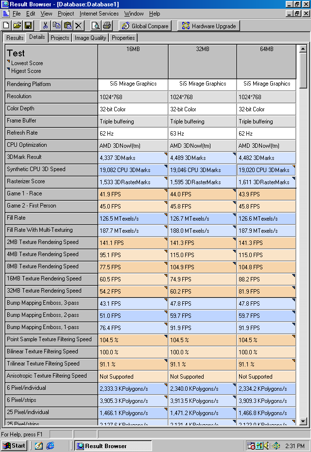

## HP T5720 VGA Share Memory Setup Utility v1.00

Command line utility to configure memory mode of integrated SiS Mirage Graphics. It modifies certain CMOS variable that holds BIOS settings for VGA Share Memory. Unfortunately HP disabled this and many other options in the menu. Works with DOS and Windows 9x only (requires unrestricted access to PC ports).
```
Usage: T5720VGA.COM [Option]
	/16  - allocate  16MB to the integrated graphics processor
	/32  - allocate  32MB to the integrated graphics processor
	/64  - allocate  64MB to the integrated graphics processor
	/128 - allocate 128MB to the integrated graphics processor
```
Execute without parameter to see current configuration.

Benchmark results for stock CPU, 1GB RAM. 128MB mode caused 3DMark to hang Windows 98SE.

